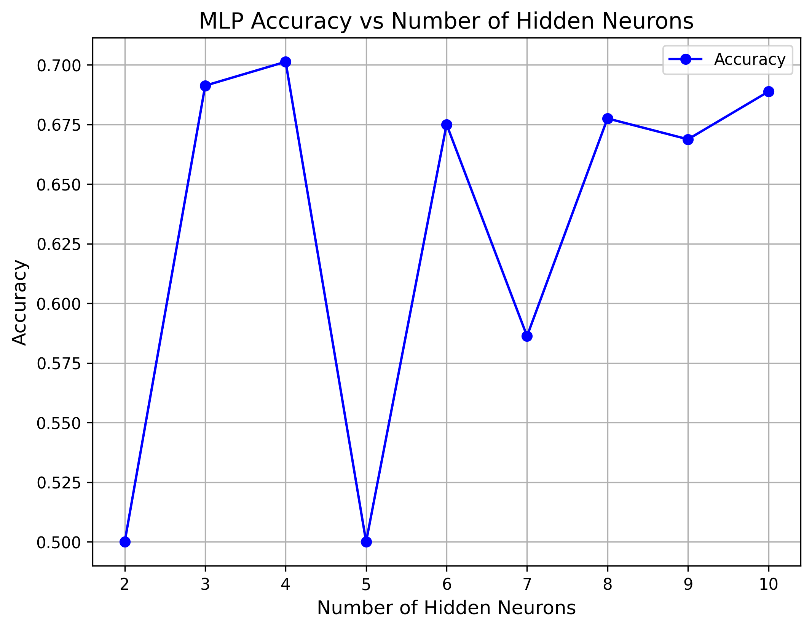

# Prática 04
Essa prática será similar às outra práticas já realizadas, porém iremos aplicar a técnica do MLP.

Para ver as informações completas sobre a prática basta acessar o arquivo "Aula_Pratica_MLP.pdf" que está disponível aqui no repositório.

As bases estão disponíveis no link: https://drive.google.com/drive/folders/1aqL9jJOSAXDsgoufgwPLSYuYexJPZRBx?usp=drive_link

## Desenvolvimento da prática
A prática foi toda desenvolvida no notebook [Pratica04_NB.ipynb](https://github.com/rikdantas/Aprendizagem-de-Maquinas/blob/main/IMD1101/Pratica_04/Pratica04_MLP.ipynb). Nele iremos baixar as bases de dados, importá-las e depois aplicar a técnica de MLP para dois tipos diferentes de técnicas de treinamento e teste.
São elas o holdout 70/30 e o 10-fold CV (KFold). 

Os hiperparâmetros da MLP serão variados, de acordo como a prática pede. Foram usadas 9 configurações diferentes. Elas estão descritas na tabela a seguir:
| | Config. 1 | Config. 2 | Config. 3 | Config. 4 | Config. 5 | Config. 6 | Config. 7 | Config. 8 | Config. 9 |
|-----------------------|-----------|-----------|-----------|-----------|-----------|-----------|-----------|-----------|-----------|
| Otimizador           | adam      | adam      | adam      | adam      | adam      | adam      | adam      | adam      | adam      |
| Função de ativação    | relu      | relu      | relu      | relu      | relu      | relu      | relu      | relu      | relu      |
| Learning rate         | 0,001     | 0,001     | 0,001     | 0,01      | 0,01      | 0,01      | 0,1       | 0,1       | 0,1       |
| Iterações            | 500       | 1000      | 1500      | 500       | 1000      | 1500      | 500       | 1000      | 1500      |

Ainda falando sobre os hiperparâmetros, no que se diz respeito as camadas ocultas, foi instruído utilizar uma fórmula que foi passada em sala:

 $(atributos+classes) / 2$

Como temos bases com a quantidade de atributos diferentes, os nossos valores ficaram da seguinte forma.

- Bases VGG -> 256 camadas ocultas.

- Bases PCA -> 6 camadas ocultas.

Os resultados foram salvos em um CSV e guardados na pasta [resultados](https://github.com/rikdantas/Aprendizagem-de-Maquinas/tree/main/IMD1101/Pratica_04/Resultados) desse repositório.

### Planilha
Assim como pedido na prática, foi construída uma planilha para analisar melhor a acurácia do modelo. A planilha pode ser acessada no link a seguir: https://docs.google.com/spreadsheets/d/1kEHVaK29Fak6TTTTWr5krSFuoCekONI2CGI2UGiL53A/edit?usp=sharing.

Com base nas médias foi possível observar uma tendência em que as configurações com o menor learning_rate foram as que apresentaram a melhor acurácia. Já analisando separadamente, a base que mostrou a maior acurácia foi a base "PCA_CNN_VGG19_128_avg" com a técnica 10-fold CV, que mostrou uma acurácia de 74,5%.

## Extra
Como etapa extra, foi desenvolvido uma análise da acurácia conforme a quantidade de neurônios na camada oculta é variada. Para isso usamos a seguinte configuração:

| | Configuração|
|-------------------------------|-----------|
| Otimizador                    | adam      |
| Função de ativação            | relu      | 
| Learning rate                 | 0,001     | 
| Iterações                     | 1500      |
| Neurônios na camada oculta    | 2 até 10  |

Como técnica de treinamento/teste foi utilizado o 10-fold CV. O gráfico resultante pode ser visto a seguir:

Nesse experimento, não foi possível observar um padrão para analisar as zonas de underfit e overfit do modelo.